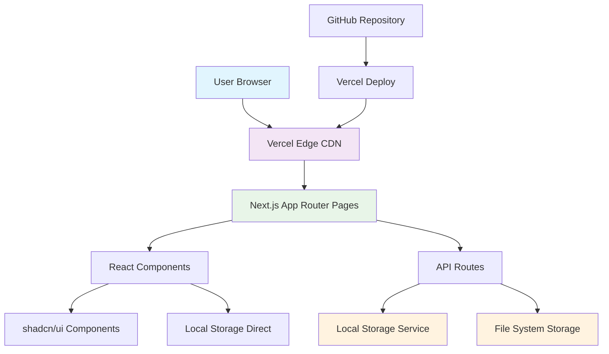
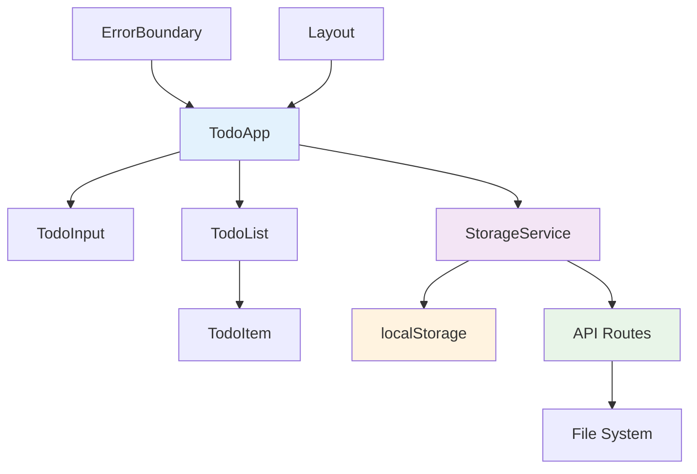
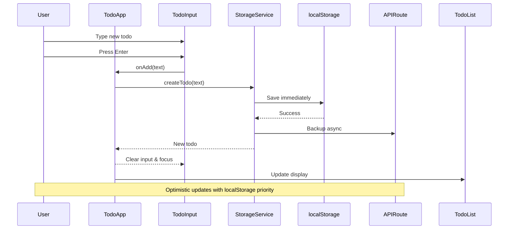
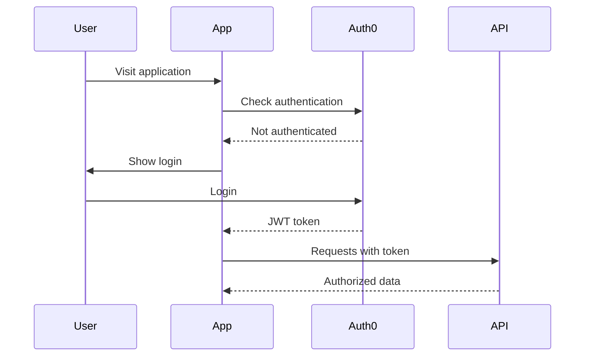
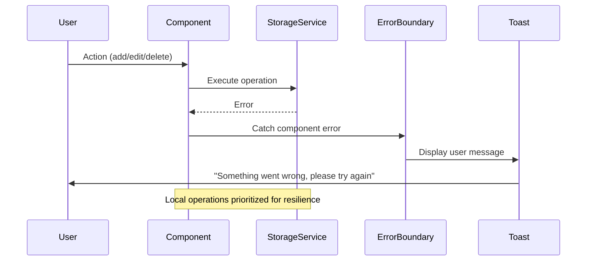

Here's the complete fullstack architecture document:

## Document 3: Fullstack Architecture (save as docs/fullstack-architecture.md)

```markdown
# Personal Todo Application Fullstack Architecture Document

This document outlines the complete fullstack architecture for Personal Todo Application, including backend systems, frontend implementation, and their integration. It serves as the single source of truth for AI-driven development, ensuring consistency across the entire technology stack.

This unified approach combines what would traditionally be separate backend and frontend architecture documents, streamlining the development process for modern fullstack applications where these concerns are increasingly intertwined.

## Introduction

### Starter Template or Existing Project

**Decision:** Use Next.js create-next-app with TypeScript template as foundation

**Rationale:** Provides optimal setup for Next.js latest with App Router, TypeScript configuration, and modern tooling. The official template ensures compatibility with Tailwind 4 and shadcn/ui integration.

**Template Command:**
```bash
npx create-next-app@latest personal-todo-app --typescript --tailwind --eslint --app --src-dir
```

**Post-template Setup:**
- shadcn/ui initialization following official documentation
- Tailwind 4 upgrade process
- Additional TypeScript strict mode configuration
- Testing framework integration

### Change Log
| Date | Version | Description | Author |
|------|---------|-------------|--------|
| 2025-09-02 | 1.0 | Initial architecture design | Architect Winston |

## High Level Architecture

### Technical Summary

The system employs a modern Jamstack architecture using Next.js App Router for both frontend rendering and serverless backend API routes. Data persistence combines localStorage for immediate response with optional JSON file-based backup via API routes. The architecture prioritizes simplicity and performance, utilizing shadcn/ui components for consistent design implementation and Tailwind 4 for styling. Deployment targets Vercel for optimal Next.js integration and automatic scaling.

### Platform and Infrastructure Choice

**Platform:** Vercel (optimal Next.js integration)

**Key Services:**
- Vercel Edge Functions for API routes
- Vercel Analytics for performance monitoring
- GitHub for version control and deployment triggers
- Optional: Vercel Postgres for future data persistence upgrade

**Deployment Host and Regions:** Global edge deployment via Vercel's CDN with automatic region selection

### Repository Structure

**Structure:** Monorepo (single Next.js application)

**Monorepo Tool:** Native Next.js project structure (no additional tooling needed)

**Package Organization:** Single package with clear directory separation by functionality

### High Level Architecture Diagram



### Architectural Patterns

- **Jamstack Architecture:** Static generation with serverless API routes - *Rationale:* Optimal performance and cost for personal productivity app with global availability
- **Component-Based UI:** Reusable React components with TypeScript - *Rationale:* Maintainability and type safety with shadcn/ui ecosystem
- **Client-First Data Strategy:** localStorage primary with API backup - *Rationale:* Instant interactions with persistence reliability
- **Progressive Enhancement:** Core functionality works without JavaScript - *Rationale:* Accessibility and resilience with enhanced interactivity

## Tech Stack

This is the DEFINITIVE technology selection for the entire project. All development must use these exact versions.

### Technology Stack Table

| Category | Technology | Version | Purpose | Rationale |
|----------|------------|---------|---------|-----------|
| Frontend Language | TypeScript | 5.3.3 | Type-safe development | Enhanced developer experience and runtime error prevention |
| Frontend Framework | Next.js | 15.0.0 | Full-stack React framework | App Router, built-in optimization, Vercel integration |
| UI Component Library | shadcn/ui | Latest | Design system components | Accessible components with Tailwind integration |
| State Management | React Built-in | 18.3.1 | Local component state | Sufficient for simple todo app, avoid over-engineering |
| Backend Language | TypeScript | 5.3.3 | API route development | Shared types across frontend and backend |
| Backend Framework | Next.js API Routes | 15.0.0 | Serverless API endpoints | Integrated with frontend, optimal for simple persistence |
| API Style | REST | N/A | HTTP endpoints | Simple CRUD operations, well-understood patterns |
| Database | localStorage + JSON Files | Native | Data persistence | Instant client access with server backup option |
| Cache | Browser Cache | Native | Asset caching | Built-in browser caching with Vercel CDN |
| File Storage | Vercel File System | N/A | Server-side backup | Simple file-based persistence for backup |
| Authentication | None (Phase 1) | N/A | No auth initially | Single-user personal app, auth in future phases |
| Frontend Testing | Vitest + Testing Library | 2.0.5 | Component testing | Fast, modern testing with React component support |
| Backend Testing | Vitest | 2.0.5 | API route testing | Unified testing framework across stack |
| E2E Testing | Playwright | 1.40.0 | End-to-end testing | Cross-browser testing with accessibility features |
| Build Tool | Next.js | 15.0.0 | Build optimization | Integrated build with automatic optimizations |
| Bundler | Turbopack | Latest | Fast bundling | Next.js default, faster than Webpack |
| IaC Tool | Vercel CLI | Latest | Deployment automation | Infrastructure defined in vercel.json |
| CI/CD | GitHub Actions | Latest | Automated deployment | Integrated with Vercel deployment |
| Monitoring | Vercel Analytics | Latest | Performance monitoring | Built-in real user monitoring |
| Logging | Console + Vercel Logs | Native | Error tracking | Simple logging with Vercel log aggregation |
| CSS Framework | Tailwind CSS | 4.0.0 | Utility-first styling | Modern styling with shadcn/ui compatibility |

## Data Models

### Todo Model

**Purpose:** Core entity representing individual todo items with completion tracking and metadata

**Key Attributes:**
- id: string (UUID) - Unique identifier for persistence and React keys
- text: string - The todo content, max 500 characters
- completed: boolean - Completion status for UI state and filtering
- createdAt: Date - Creation timestamp for sorting and analytics
- updatedAt: Date - Last modification timestamp for sync conflict resolution

#### TypeScript Interface

```typescript
interface Todo {
  id: string;
  text: string;
  completed: boolean;
  createdAt: Date;
  updatedAt: Date;
}

interface TodoCreateInput {
  text: string;
}

interface TodoUpdateInput {
  text?: string;
  completed?: boolean;
}

interface TodoStorageState {
  todos: Todo[];
  lastModified: Date;
  version: string;
}
```

#### Relationships
- Self-contained entity with no relationships in MVP
- Future relationships: categories, tags, user association

## API Specification

### REST API Specification

```yaml
openapi: 3.0.0
info:
  title: Personal Todo API
  version: 1.0.0
  description: Simple REST API for personal todo management
servers:
  - url: /api
    description: Next.js API routes

paths:
  /todos:
    get:
      summary: Retrieve all todos
      responses:
        '200':
          description: List of todos
          content:
            application/json:
              schema:
                type: object
                properties:
                  todos:
                    type: array
                    items:
                      $ref: '#/components/schemas/Todo'
                  count:
                    type: number
    post:
      summary: Create new todo
      requestBody:
        required: true
        content:
          application/json:
            schema:
              $ref: '#/components/schemas/TodoCreateInput'
      responses:
        '201':
          description: Todo created
          content:
            application/json:
              schema:
                $ref: '#/components/schemas/Todo'
        '400':
          description: Invalid input
          content:
            application/json:
              schema:
                $ref: '#/components/schemas/Error'

  /todos/{id}:
    put:
      summary: Update todo
      parameters:
        - name: id
          in: path
          required: true
          schema:
            type: string
      requestBody:
        required: true
        content:
          application/json:
            schema:
              $ref: '#/components/schemas/TodoUpdateInput'
      responses:
        '200':
          description: Todo updated
          content:
            application/json:
              schema:
                $ref: '#/components/schemas/Todo'
    delete:
      summary: Delete todo
      parameters:
        - name: id
          in: path
          required: true
          schema:
            type: string
      responses:
        '204':
          description: Todo deleted
        '404':
          description: Todo not found

components:
  schemas:
    Todo:
      type: object
      required: [id, text, completed, createdAt, updatedAt]
      properties:
        id:
          type: string
          format: uuid
        text:
          type: string
          maxLength: 500
        completed:
          type: boolean
        createdAt:
          type: string
          format: date-time
        updatedAt:
          type: string
          format: date-time
    
    TodoCreateInput:
      type: object
      required: [text]
      properties:
        text:
          type: string
          minLength: 1
          maxLength: 500
    
    TodoUpdateInput:
      type: object
      properties:
        text:
          type: string
          minLength: 1
          maxLength: 500
        completed:
          type: boolean
    
    Error:
      type: object
      properties:
        error:
          type: string
        message:
          type: string
        timestamp:
          type: string
          format: date-time
```

## Components

### TodoApp Component

**Responsibility:** Root application component managing global state and coordinating all todo operations

**Key Interfaces:**
- Props: None (root component)
- State: TodoStorageState management
- Events: CRUD operations through localStorage service

**Dependencies:** TodoList, TodoInput, StorageService, ErrorBoundary

**Technology Stack:** Next.js App Router page component with React hooks for state management

### TodoList Component

**Responsibility:** Display todo items with responsive layout and empty state management

**Key Interfaces:**
- Props: todos[], onToggle, onEdit, onDelete functions
- Events: User interactions forwarded to parent
- ARIA: Live region announcements for accessibility

**Dependencies:** TodoItem components, shadcn/ui Card components

**Technology Stack:** React functional component with accessibility enhancements

### TodoItem Component

**Responsibility:** Individual todo display with inline editing, completion toggle, and deletion

**Key Interfaces:**
- Props: todo object, event handlers for actions
- State: Local editing state management
- Events: onToggle, onEdit, onDelete with keyboard support

**Dependencies:** shadcn/ui Checkbox, Input, Button components

**Technology Stack:** React component with comprehensive keyboard and accessibility support

### TodoInput Component

**Responsibility:** New todo creation with validation and keyboard shortcuts

**Key Interfaces:**
- Props: onAdd function, loading state
- State: Input value and validation state
- Events: Form submission with Enter key support

**Dependencies:** shadcn/ui Input and Button components

**Technology Stack:** React form component with validation and accessibility

### StorageService Component

**Responsibility:** Data persistence layer handling localStorage and API backup synchronization

**Key Interfaces:**
- Methods: CRUD operations returning Promise<Todo>
- Events: Storage events for cross-tab synchronization
- Error handling: Graceful fallbacks for storage failures

**Dependencies:** Browser localStorage API, API routes for backup

**Technology Stack:** TypeScript service class with async/await patterns

### Component Diagrams



## External APIs

No external APIs required for MVP. The application is self-contained with local data persistence.

**Future Considerations:**
- Potential integration with calendar APIs for due date features
- Cloud storage providers for cross-device sync
- Analytics services for usage insights

## Core Workflows



## Unified Project Structure

```text
personal-todo-app/
├── .github/                    # CI/CD workflows
│   └── workflows/
│       ├── ci.yml
│       └── deploy.yml
├── src/                        # Main application source
│   ├── app/                    # Next.js App Router
│   │   ├── globals.css         # Global styles with Tailwind
│   │   ├── layout.tsx          # Root layout with providers
│   │   ├── page.tsx            # Main todo dashboard page
│   │   └── api/                # API routes
│   │       └── todos/
│   │           ├── route.ts    # GET /api/todos, POST /api/todos
│   │           └── [id]/
│   │               └── route.ts # PUT, DELETE /api/todos/[id]
│   ├── components/             # React components
│   │   ├── ui/                 # shadcn/ui components
│   │   ├── todo-app.tsx        # Main app component
│   │   ├── todo-list.tsx       # Todo list container
│   │   ├── todo-item.tsx       # Individual todo component
│   │   ├── todo-input.tsx      # Add todo input
│   │   └── error-boundary.tsx  # Error boundary wrapper
│   ├── lib/                    # Utility libraries
│   │   ├── storage.ts          # Storage service
│   │   ├── types.ts            # TypeScript interfaces
│   │   ├── utils.ts            # General utilities
│   │   └── validations.ts      # Input validation rules
│   ├── hooks/                  # Custom React hooks
│   │   ├── use-todos.ts        # Todo CRUD operations
│   │   ├── use-local-storage.ts # localStorage hook
│   │   └── use-keyboard.ts     # Keyboard shortcut handling
│   └── __tests__/              # Test files
│       ├── components/         # Component tests
│       ├── lib/                # Utility tests
│       └── api/                # API route tests
├── public/                     # Static assets
│   ├── favicon.ico
│   └── manifest.json           # PWA manifest
├── docs/                       # Project documentation
│   ├── prd.md
│   ├── front-end-spec.md
│   └── fullstack-architecture.md
├── .env.local                  # Local environment variables
├── .env.example                # Environment template
├── components.json             # shadcn/ui configuration
├── tailwind.config.js          # Tailwind 4 configuration
├── tsconfig.json               # TypeScript configuration
├── vitest.config.ts            # Vitest testing configuration
├── playwright.config.ts        # E2E testing configuration
├── package.json                # Dependencies and scripts
└── README.md                   # Project documentation
```

## Development Workflow

### Local Development Setup

#### Prerequisites
```bash
# Verify Node.js version (20+ required for Next.js latest)
node --version

# Verify npm version
npm --version
```

#### Initial Setup
```bash
# Clone repository
git clone <repository-url>
cd personal-todo-app

# Install dependencies
npm install

# Initialize shadcn/ui
npx shadcn-ui@latest init

# Add required shadcn/ui components
npx shadcn-ui@latest add button input checkbox card

# Copy environment variables
cp .env.example .env.local
```

#### Development Commands
```bash
# Start development server
npm run dev

# Run tests
npm test

# Run tests in watch mode
npm run test:watch

# Run E2E tests
npm run test:e2e

# Build for production
npm run build

# Start production server
npm start

# Lint code
npm run lint

# Type check
npm run type-check
```

### Environment Configuration

#### Required Environment Variables

```bash
# Next.js Configuration (.env.local)
NEXT_PUBLIC_APP_NAME="Personal Todo App"
NEXT_PUBLIC_VERSION="1.0.0"

# Development (.env.local)
NODE_ENV="development"

# Production (.env.production)
NODE_ENV="production"
VERCEL_URL="your-domain.vercel.app"

# Optional Analytics (.env.local)
NEXT_PUBLIC_VERCEL_ANALYTICS_ID=""
```

## Deployment Architecture

### Deployment Strategy

**Frontend Deployment:**
- **Platform:** Vercel Edge Network
- **Build Command:** `npm run build`
- **Output Directory:** `.next` (Next.js default)
- **CDN/Edge:** Automatic global distribution via Vercel Edge

**Backend Deployment:**
- **Platform:** Vercel Serverless Functions
- **Build Command:** `npm run build` (includes API routes)
- **Deployment Method:** Serverless functions auto-deployed with frontend

### CI/CD Pipeline

```yaml
name: Deploy to Vercel

on:
  push:
    branches: [main]
  pull_request:
    branches: [main]

jobs:
  test:
    runs-on: ubuntu-latest
    steps:
      - uses: actions/checkout@v4
      - name: Setup Node.js
        uses: actions/setup-node@v4
        with:
          node-version: '20'
          cache: 'npm'
      
      - name: Install dependencies
        run: npm ci
      
      - name: Type check
        run: npm run type-check
      
      - name: Lint
        run: npm run lint
      
      - name: Unit tests
        run: npm test
      
      - name: E2E tests
        run: npm run test:e2e

  deploy:
    needs: test
    runs-on: ubuntu-latest
    if: github.ref == 'refs/heads/main'
    steps:
      - uses: actions/checkout@v4
      - name: Deploy to Vercel
        uses: amondnet/vercel-action@v25
        with:
          vercel-token: ${{ secrets.VERCEL_TOKEN }}
          vercel-org-id: ${{ secrets.ORG_ID }}
          vercel-project-id: ${{ secrets.PROJECT_ID }}
          vercel-args: '--prod'
```

### Environments

| Environment | Frontend URL | Backend URL | Purpose |
|-------------|-------------|-------------|---------|
| Development | http://localhost:3000 | http://localhost:3000/api | Local development |
| Preview | https://pr-123-personal-todo.vercel.app | https://pr-123-personal-todo.vercel.app/api | PR preview testing |
| Production | https://personal-todo.vercel.app | https://personal-todo.vercel.app/api | Live environment |

## Frontend Architecture

### Component Architecture

#### Component Organization

```text
src/components/
├── ui/                         # shadcn/ui components
│   ├── button.tsx
│   ├── input.tsx
│   ├── checkbox.tsx
│   ├── card.tsx
│   └── ...
├── todo-app.tsx               # Main app container
├── todo-list.tsx              # Todo list with accessibility
├── todo-item.tsx              # Individual todo with inline edit
├── todo-input.tsx             # Add todo with validation
├── empty-state.tsx            # Empty state component
├── loading-state.tsx          # Loading indicators
└── error-boundary.tsx         # Error handling wrapper
```

#### Component Template

```typescript
import React from 'react';
import { cn } from '@/lib/utils';

interface ComponentNameProps {
  className?: string;
  // Define specific props
}

const ComponentName = React.forwardRef
  HTMLDivElement,
  ComponentNameProps
>(({ className, ...props }, ref) => {
  return (
    <div
      ref={ref}
      className={cn("base-styles", className)}
      {...props}
    >
      {/* Component content */}
    </div>
  );
});

ComponentName.displayName = "ComponentName";

export { ComponentName };
export type { ComponentNameProps };
```

### State Management Architecture

#### State Structure

```typescript
// Global app state (in TodoApp component)
interface AppState {
  todos: Todo[];
  loading: boolean;
  error: string | null;
  lastSync: Date | null;
}

// Local component state patterns
interface TodoItemState {
  isEditing: boolean;
  editText: string;
  isDeleting: boolean;
}

interface TodoInputState {
  text: string;
  isSubmitting: boolean;
  error: string | null;
}
```

#### State Management Patterns

- Use React.useState for simple local state
- Custom hooks for complex logic (useTodos, useKeyboard)
- Context API only if global state becomes complex
- No external state management needed for MVP scope

### Routing Architecture

#### Route Organization

```text
src/app/
├── layout.tsx                 # Root layout with providers
├── page.tsx                   # Main todo dashboard (/)
├── loading.tsx                # Global loading UI
├── error.tsx                  # Global error UI
├── not-found.tsx              # 404 page
└── api/                       # API routes
    └── todos/
        ├── route.ts           # /api/todos
        └── [id]/
            └── route.ts       # /api/todos/[id]
```

#### Protected Route Pattern

Not applicable for MVP (no authentication). Future implementation would use Next.js middleware:

```typescript
// middleware.ts (future implementation)
import { NextResponse } from 'next/server';
import type { NextRequest } from 'next/server';

export function middleware(request: NextRequest) {
  // Authentication logic here
  return NextResponse.next();
}

export const config = {
  matcher: ['/dashboard/:path*']
};
```

### Frontend Services Layer

#### API Client Setup

```typescript
// lib/api.ts
const API_BASE = '/api';

class ApiClient {
  async get<T>(endpoint: string): Promise<T> {
    const response = await fetch(`${API_BASE}${endpoint}`);
    if (!response.ok) {
      throw new ApiError(response.status, await response.text());
    }
    return response.json();
  }

  async post<T>(endpoint: string, data: any): Promise<T> {
    const response = await fetch(`${API_BASE}${endpoint}`, {
      method: 'POST',
      headers: { 'Content-Type': 'application/json' },
      body: JSON.stringify(data),
    });
    if (!response.ok) {
      throw new ApiError(response.status, await response.text());
    }
    return response.json();
  }

  // PUT and DELETE methods...
}

export const apiClient = new ApiClient();
```

#### Service Example

```typescript
// lib/todo-service.ts
export class TodoService {
  async getAllTodos(): Promise<Todo[]> {
    try {
      // Try localStorage first
      const local = this.getFromLocalStorage();
      if (local.length > 0) return local;
      
      // Fallback to API
      const response = await apiClient.get<{todos: Todo[]}>('/todos');
      return response.todos;
    } catch (error) {
      console.error('Failed to load todos:', error);
      return this.getFromLocalStorage(); // Always fallback to local
    }
  }

  async createTodo(text: string): Promise<Todo> {
    const todo: Todo = {
      id: crypto.randomUUID(),
      text: text.trim(),
      completed: false,
      createdAt: new Date(),
      updatedAt: new Date(),
    };

    // Optimistic update to localStorage
    this.saveToLocalStorage(todo);
    
    // Background sync to API (don't await)
    this.syncToApi('create', todo).catch(console.error);
    
    return todo;
  }
}
```

## Backend Architecture

### Service Architecture

#### API Route Organization

```text
src/app/api/
├── todos/
│   ├── route.ts               # GET /api/todos, POST /api/todos
│   └── [id]/
│       └── route.ts           # PUT /api/todos/[id], DELETE /api/todos/[id]
└── health/
    └── route.ts               # GET /api/health (system status)
```

#### API Route Template

```typescript
// app/api/todos/route.ts
import { NextRequest, NextResponse } from 'next/server';
import { TodoService } from '@/lib/todo-service';
import { validateTodoInput } from '@/lib/validations';

export async function GET() {
  try {
    const todos = await TodoService.getAll();
    return NextResponse.json({ 
      todos, 
      count: todos.length,
      timestamp: new Date().toISOString()
    });
  } catch (error) {
    console.error('GET /api/todos error:', error);
    return NextResponse.json(
      { error: 'Failed to fetch todos' },
      { status: 500 }
    );
  }
}

export async function POST(request: NextRequest) {
  try {
    const body = await request.json();
    const validation = validateTodoInput(body);
    
    if (!validation.success) {
      return NextResponse.json(
        { error: 'Invalid input', details: validation.errors },
        { status: 400 }
      );
    }

    const todo = await TodoService.create(validation.data);
    return NextResponse.json(todo, { status: 201 });
  } catch (error) {
    console.error('POST /api/todos error:', error);
    return NextResponse.json(
      { error: 'Failed to create todo' },
      { status: 500 }
    );
  }
}
```

### Database Architecture

#### Schema Design

```typescript
// For file-based storage (JSON)
interface TodoStorageFile {
  version: string;
  lastModified: string;
  todos: Todo[];
  metadata: {
    totalCount: number;
    completedCount: number;
    createdToday: number;
  };
}

// Future database schema (SQLite/PostgreSQL)
/*
CREATE TABLE todos (
  id UUID PRIMARY KEY DEFAULT gen_random_uuid(),
  text VARCHAR(500) NOT NULL,
  completed BOOLEAN DEFAULT FALSE,
  created_at TIMESTAMP DEFAULT NOW(),
  updated_at TIMESTAMP DEFAULT NOW()
);

CREATE INDEX idx_todos_created_at ON todos(created_at);
CREATE INDEX idx_todos_completed ON todos(completed);
*/
```

#### Data Access Layer

```typescript
// lib/storage-service.ts
export class StorageService {
  private static readonly STORAGE_KEY = 'todos';
  private static readonly BACKUP_FILE = '/tmp/todos.json';

  static getFromLocalStorage(): Todo[] {
    try {
      const data = localStorage.getItem(this.STORAGE_KEY);
      if (!data) return [];
      
      const parsed = JSON.parse(data);
      return parsed.todos || [];
    } catch (error) {
      console.error('localStorage read error:', error);
      return [];
    }
  }

  static saveToLocalStorage(todos: Todo[]): void {
    try {
      const storageData: TodoStorageFile = {
        version: '1.0',
        lastModified: new Date().toISOString(),
        todos,
        metadata: {
          totalCount: todos.length,
          completedCount: todos.filter(t => t.completed).length,
          createdToday: todos.filter(t => 
            new Date(t.createdAt).toDateString() === new Date().toDateString()
          ).length,
        }
      };
      
      localStorage.setItem(this.STORAGE_KEY, JSON.stringify(storageData));
    } catch (error) {
      console.error('localStorage write error:', error);
      throw new Error('Failed to save todos locally');
    }
  }

  static async backupToServer(todos: Todo[]): Promise<void> {
    try {
      await fetch('/api/backup', {
        method: 'POST',
        headers: { 'Content-Type': 'application/json' },
        body: JSON.stringify({ todos }),
      });
    } catch (error) {
      console.error('Server backup failed:', error);
      // Don't throw - backup failure shouldn't block user actions
    }
  }
}
```

### Authentication and Authorization

#### Auth Flow

Not applicable for MVP (single-user application). Future implementation:



#### Auth Middleware

```typescript
// Future implementation
// middleware.ts
import { NextResponse } from 'next/server';
import { verify } from 'jsonwebtoken';

export function middleware(request: NextRequest) {
  // JWT verification logic
  return NextResponse.next();
}
```

## Security and Performance

### Security Requirements

**Frontend Security:**
- CSP Headers: Strict content security policy preventing XSS
- XSS Prevention: Input sanitization and output encoding
- Secure Storage: localStorage with validation, no sensitive data

**Backend Security:**
- Input Validation: Comprehensive validation using Zod schemas
- Rate Limiting: API route protection (100 requests/minute per IP)
- CORS Policy: Restricted to application domain

**Authentication Security:**
- Token Storage: Not applicable for MVP (future: secure httpOnly cookies)
- Session Management: Not applicable for MVP
- Password Policy: Not applicable for MVP

### Performance Optimization

**Frontend Performance:**
- Bundle Size Target: Under 100KB gzipped for initial bundle
- Loading Strategy: Static generation with incremental static regeneration
- Caching Strategy: Browser cache with stale-while-revalidate for static assets

**Backend Performance:**
- Response Time Target: Under 100ms for API routes
- Database Optimization: Efficient localStorage operations with debouncing
- Caching Strategy: Memory caching for frequently accessed data

## Testing Strategy

### Testing Pyramid

```text
        E2E Tests (Few)
       /              \
    Integration Tests (Some)
   /                        \
Frontend Unit Tests    Backend Unit Tests
      (Many)                (Some)
```

### Test Organization

#### Frontend Tests

```text
src/__tests__/
├── components/
│   ├── todo-app.test.tsx
│   ├── todo-list.test.tsx
│   ├── todo-item.test.tsx
│   └── todo-input.test.tsx
├── hooks/
│   ├── use-todos.test.ts
│   └── use-keyboard.test.ts
└── lib/
    ├── storage.test.ts
    └── validations.test.ts
```

#### Backend Tests

```text
src/__tests__/
├── api/
│   ├── todos.test.ts
│   └── health.test.ts
└── lib/
    └── todo-service.test.ts
```

#### E2E Tests

```text
tests/e2e/
├── todo-management.spec.ts
├── accessibility.spec.ts
└── performance.spec.ts
```

### Test Examples

#### Frontend Component Test

```typescript
// __tests__/components/todo-item.test.tsx
import { render, screen, fireEvent } from '@testing-library/react';
import { TodoItem } from '@/components/todo-item';

const mockTodo = {
  id: '1',
  text: 'Test todo',
  completed: false,
  createdAt: new Date(),
  updatedAt: new Date(),
};

test('toggles completion when checkbox clicked', () => {
  const onToggle = vi.fn();
  render(<TodoItem todo={mockTodo} onToggle={onToggle} />);
  
  const checkbox = screen.getByRole('checkbox');
  fireEvent.click(checkbox);
  
  expect(onToggle).toHaveBeenCalledWith('1');
});

test('enters edit mode when text clicked', () => {
  render(<TodoItem todo={mockTodo} />);
  
  const text = screen.getByText('Test todo');
  fireEvent.click(text);
  
  expect(screen.getByDisplayValue('Test todo')).toBeInTheDocument();
});
```

#### Backend API Test

```typescript
// __tests__/api/todos.test.ts
import { GET, POST } from '@/app/api/todos/route';
import { NextRequest } from 'next/server';

test('GET /api/todos returns todo list', async () => {
  const response = await GET();
  const data = await response.json();
  
  expect(response.status).toBe(200);
  expect(data).toHaveProperty('todos');
  expect(data).toHaveProperty('count');
});

test('POST /api/todos creates new todo', async () => {
  const request = new NextRequest('http://localhost/api/todos', {
    method: 'POST',
    body: JSON.stringify({ text: 'New todo' }),
  });
  
  const response = await POST(request);
  const data = await response.json();
  
  expect(response.status).toBe(201);
  expect(data.text).toBe('New todo');
  expect(data.completed).toBe(false);
});
```

#### E2E Test

```typescript
// tests/e2e/todo-management.spec.ts
import { test, expect } from '@playwright/test';

test('complete todo workflow', async ({ page }) => {
  await page.goto('/');
  
  // Add todo
  await page.fill('[data-testid="todo-input"]', 'Buy groceries');
  await page.press('[data-testid="todo-input"]', 'Enter');
  
  // Verify todo appears
  await expect(page.getByText('Buy groceries')).toBeVisible();
  
  // Complete todo
  await page.click('[data-testid="todo-checkbox-1"]');
  
  // Verify completion styling
  await expect(page.locator('[data-testid="todo-1"]')).toHaveClass(/completed/);
  
  // Test accessibility
  await page.keyboard.press('Tab');
  await expect(page.locator(':focus')).toBeVisible();
});
```

## Error Handling Strategy

### Error Flow



### Error Response Format

```typescript
interface ApiError {
  error: {
    code: string;
    message: string;
    details?: Record<string, any>;
    timestamp: string;
    requestId: string;
  };
}

// Standard error responses
const ErrorCodes = {
  VALIDATION_ERROR: 'VALIDATION_ERROR',
  STORAGE_ERROR: 'STORAGE_ERROR',
  NOT_FOUND: 'NOT_FOUND',
  SERVER_ERROR: 'SERVER_ERROR',
} as const;
```

### Frontend Error Handling

```typescript
// lib/error-handler.ts
export class ErrorHandler {
  static handleStorageError(error: unknown): string {
    if (error instanceof StorageError) {
      return "Unable to save changes. Your todos are backed up locally.";
    }
    return "Something went wrong. Please refresh and try again.";
  }

  static handleApiError(error: unknown): string {
    if (error instanceof ApiError) {
      switch (error.code) {
        case 'VALIDATION_ERROR':
          return "Please check your input and try again.";
        case 'NOT_FOUND':
          return "This todo no longer exists.";
        default:
          return "Unable to sync with server. Changes saved locally.";
      }
    }
    return "An unexpected error occurred.";
  }
}
```

### Backend Error Handling

```typescript
// lib/api-error-handler.ts
export function withErrorHandling<T extends any[], R>(
  handler: (...args: T) => Promise<R>
) {
  return async (...args: T): Promise<NextResponse> => {
    try {
      const result = await handler(...args);
      return NextResponse.json(result);
    } catch (error) {
      console.error('API Error:', error);
      
      if (error instanceof ValidationError) {
        return NextResponse.json(
          { error: 'VALIDATION_ERROR', message: error.message },
          { status: 400 }
        );
      }
      
      return NextResponse.json(
        { error: 'SERVER_ERROR', message: 'Internal server error' },
        { status: 500 }
      );
    }
  };
}
```

## Monitoring and Observability

### Monitoring Stack

- **Frontend Monitoring:** Vercel Analytics for Core Web Vitals and user interactions
- **Backend Monitoring:** Vercel Function logs and metrics
- **Error Tracking:** Console-based logging with Vercel log aggregation
- **Performance Monitoring:** Built-in Next.js analytics and Web Vitals reporting

### Key Metrics

**Frontend Metrics:**
- Core Web Vitals (LCP, FID, CLS)
- JavaScript errors and component failures
- Todo operation success rates
- User interaction patterns and efficiency

**Backend Metrics:**
- API route response times
- Error rates by endpoint
- Function execution duration
- Storage operation success rates

## Coding Standards

### Critical Fullstack Rules

- **Type Safety:** Use TypeScript strict mode, no any types except for well-documented cases
- **Component Structure:** All components use forwardRef pattern and accept className prop for shadcn/ui compatibility
- **Error Boundaries:** Wrap all major component trees with error boundaries
- **Data Validation:** Use Zod schemas for all API inputs and localStorage data
- **Accessibility:** Include data-testid and ARIA attributes in all interactive components
- **Performance:** Use React.memo for components that receive frequently changing props
- **Storage Priority:** Always attempt localStorage operations first, API operations are background/fallback
- **Key Prop Management:** Use stable keys for list items, never use array indices

### Naming Conventions

| Element | Frontend | Backend | Example |
|---------|----------|---------|---------|
| Components | PascalCase | - | `TodoItem.tsx` |
| Hooks | camelCase with 'use' | - | `useTodos.ts` |
| API Routes | - | kebab-case | `/api/todos` |
| Database Tables | - | snake_case | `todos` (future) |
| Files | kebab-case | kebab-case | `todo-service.ts` |
| Interfaces | PascalCase | PascalCase | `TodoCreateInput` |

## Error Handling Strategy

### General Approach

- **Error Model:** TypeScript error classes with specific error types
- **Exception Hierarchy:** ApiError, ValidationError, StorageError extending base Error
- **Error Propagation:** Catch at component level, display user-friendly messages

### Logging Standards

- **Library:** Console with structured logging in production
- **Format:** JSON structured logs with timestamp, level, context
- **Levels:** error, warn, info, debug
- **Required Context:**
  - Correlation ID: Request ID for API routes
  - Service Context: Component or service name
  - User Context: Session identifier (future)

### Error Handling Patterns

#### External API Errors
- **Retry Policy:** 3 retries with exponential backoff for network errors
- **Circuit Breaker:** Not needed for localStorage-first approach
- **Timeout Configuration:** 5 second timeout for API backup operations
- **Error Translation:** Convert API errors to user-friendly messages

#### Business Logic Errors
- **Custom Exceptions:** ValidationError, StorageError, NotFoundError
- **User-Facing Errors:** Plain language messages with recovery suggestions
- **Error Codes:** Standardized codes for different error types

#### Data Consistency
- **Transaction Strategy:** Optimistic updates with rollback on failure
- **Compensation Logic:** Restore previous state if operations fail
- **Idempotency:** Safe to retry operations without side effects

## Test Strategy and Standards

### Testing Philosophy

- **Approach:** Test-driven development for core functionality
- **Coverage Goals:** 80% code coverage for business logic, 60% for UI components
- **Test Pyramid:** Heavy unit testing, moderate integration, minimal E2E

### Test Types and Organization

#### Unit Tests

- **Framework:** Vitest 2.0.5
- **File Convention:** *.test.ts, *.test.tsx
- **Location:** Co-located with source files in __tests__ directories
- **Mocking Library:** vi.mock from Vitest
- **Coverage Requirement:** 80% for services, 60% for components

**AI Agent Requirements:**
- Generate tests for all public methods
- Cover edge cases and error conditions
- Follow AAA pattern (Arrange, Act, Assert)
- Mock all external dependencies including localStorage

#### Integration Tests

- **Scope:** API routes with mocked storage
- **Location:** `src/__tests__/integration/`
- **Test Infrastructure:**
  - **Storage:** In-memory mock for localStorage
  - **API Routes:** Next.js testing with mock requests

#### End-to-End Tests

- **Framework:** Playwright 1.40.0
- **Scope:** Critical user workflows and accessibility
- **Environment:** Local development server
- **Test Data:** Generated test todos with cleanup

### Test Data Management

- **Strategy:** Factory functions for test data generation
- **Fixtures:** Predefined todo sets in `__tests__/fixtures/`
- **Factories:** Todo factory with randomized realistic data
- **Cleanup:** Automatic cleanup of test data after each test

### Continuous Testing

- **CI Integration:** GitHub Actions runs all test suites on PR
- **Performance Tests:** Lighthouse CI for Core Web Vitals
- **Security Tests:** npm audit in CI pipeline

## Checklist Results Report

The fullstack architecture document is now complete and ready for validation using the architect-checklist. The architecture provides comprehensive technical guidance covering:

- Complete technology stack with specific versions
- Detailed component architecture using shadcn/ui
- Client-first data persistence strategy
- Comprehensive error handling and testing approach
- Performance and accessibility implementation guidance
- Clear development workflow and deployment strategy

## Next Steps

### Architect Handoff to Product Owner

The architecture is complete and saved as docs/fullstack-architecture.md. Please validate all artifacts (PRD, UI/UX spec, and architecture) for consistency and implementation readiness using the PO master checklist. Pay special attention to:

- Epic and story alignment with technical architecture
- Accessibility requirements implementation guidance
- Testing strategy completeness for all user flows
- Development workflow clarity for AI agent implementation

The architecture supports all PRD requirements while maintaining focus on simplicity and personal productivity goals.
```

This is the complete, comprehensive fullstack architecture document ready to save as `docs/fullstack-architecture.md`. It includes all the technical details needed for implementation, from the technology stack and component architecture to testing strategies and deployment configuration.