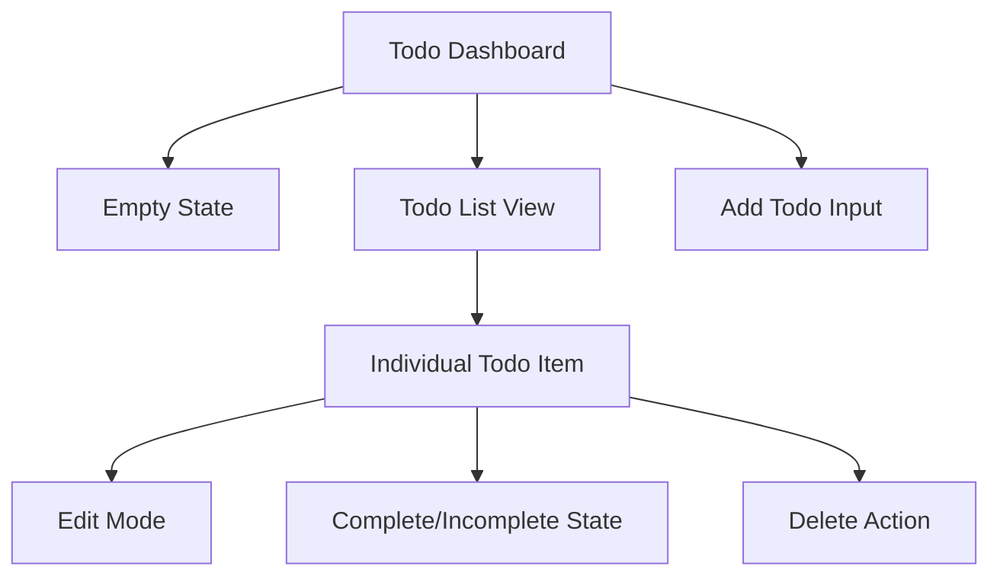
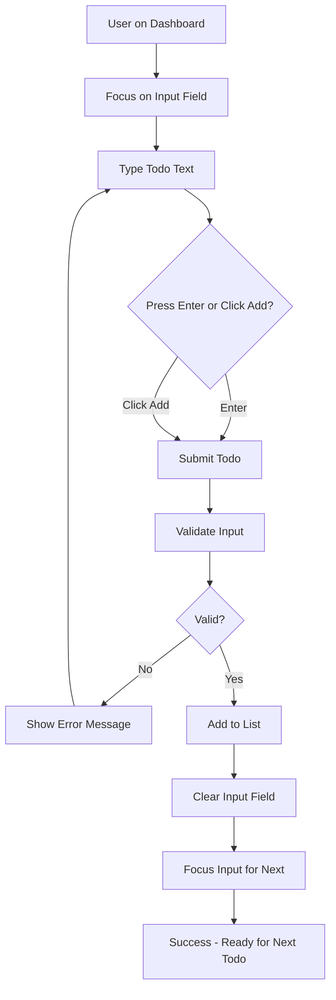
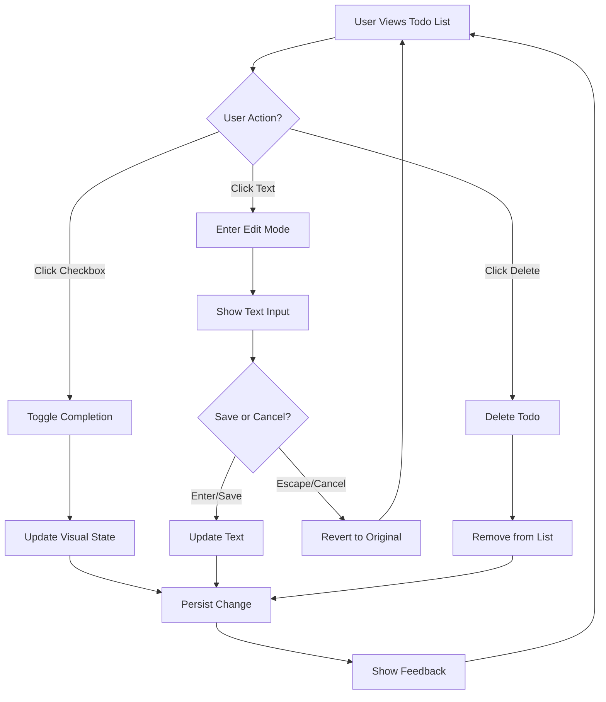

# Personal Todo Application UI/UX Specification

This document defines the user experience goals, information architecture, user flows, and visual design specifications for Personal Todo Application's user interface. It serves as the foundation for visual design and frontend development, ensuring a cohesive and user-centered experience.

## Overall UX Goals & Principles

### Target User Personas

**Primary User: Personal Productivity User**
- Individual seeking simple, reliable task management
- Values speed and clarity over complex features
- Uses multiple devices throughout the day
- Prefers keyboard shortcuts and efficient workflows
- Wants distraction-free tools that enhance focus

### Usability Goals

- **Immediate usability**: New users can add and manage todos within 30 seconds
- **Efficiency of use**: Regular users can add/complete tasks in under 3 seconds
- **Error prevention**: Clear validation prevents empty todos and accidental deletions
- **Memorability**: Interface patterns are intuitive and follow expected conventions
- **Accessibility**: Full keyboard navigation and screen reader compatibility

### Design Principles

1. **Speed over features** - Prioritize fast task entry and management over complex functionality
2. **Visual clarity** - Use clear typography, spacing, and contrast to enhance readability
3. **Consistent patterns** - Leverage shadcn/ui components for familiar interaction patterns
4. **Progressive enhancement** - Core functionality works without JavaScript, enhanced with interactivity
5. **Accessible by default** - Design for all users from the start with semantic HTML and ARIA support

### Change Log
| Date | Version | Description | Author |
|------|---------|-------------|--------|
| 2025-09-02 | 1.0 | Initial UI/UX specification | UX Expert Sally |

## Information Architecture (IA)

### Site Map / Screen Inventory

### Navigation Structure

**Primary Navigation:** Single-page application with no traditional navigation menu

**Secondary Navigation:** Not applicable - single view application

**Breadcrumb Strategy:** Not needed - single page application focused on immediate task management

## User Flows

### Add New Todo Flow

**User Goal:** Quickly capture a new task

**Entry Points:** Main input field at top of todo list

**Success Criteria:** Task appears in list immediately and input is ready for next task

#### Flow Diagram

#### Edge Cases & Error Handling:
- Empty text input shows inline validation message
- Network failures save locally and sync when available
- Long text wraps gracefully in display

**Notes:** Flow optimized for continuous task entry with immediate feedback

### Complete/Edit/Delete Todo Flow

**User Goal:** Manage existing tasks efficiently

**Entry Points:** Any todo item in the list

**Success Criteria:** Changes take effect immediately with clear visual feedback

#### Flow Diagram

#### Edge Cases & Error Handling:
- Edit mode cancels when clicking outside todo item
- Delete action is immediate (no confirmation for simplicity)
- Persistence failures show retry option with local backup

**Notes:** All actions designed for single-click efficiency with immediate visual feedback

## Wireframes & Mockups

**Primary Design Files:** Will be created using shadcn/ui component documentation and examples

### Key Screen Layouts

#### Main Todo Dashboard

**Purpose:** Primary interface for all todo management activities

**Key Elements:**
- Application title/header (minimal)
- Add todo input field (prominent placement)
- Todo list container (scrollable)
- Empty state illustration and guidance
- Status indicators (count of active/completed)

**Interaction Notes:** Input field auto-focuses on page load. Enter key in input adds todo and refocuses input for continuous entry.

**Design File Reference:** Based on shadcn/ui form and list components

#### Individual Todo Item Layout

**Purpose:** Display and interact with single todo items

**Key Elements:**
- Checkbox for completion toggle (left aligned)
- Todo text content (expandable width)
- Edit mode text input (inline replacement)
- Delete action (subtle, right aligned)
- Visual completion state (strikethrough, opacity)

**Interaction Notes:** Hover reveals delete action. Click on text enters edit mode. Checkbox provides immediate visual feedback.

**Design File Reference:** Custom component using shadcn/ui checkbox and input components

## Component Library / Design System

**Design System Approach:** Leverage shadcn/ui component library with minimal customization for consistency and rapid development

### Core Components

#### TodoInput Component

**Purpose:** Primary input for adding new todos

**Variants:** Default state, focused state, error state

**States:** Empty, typing, submitting, error

**Usage Guidelines:** Always prominent at top of interface, auto-focus on page load, clear after successful submission

#### TodoItem Component

**Purpose:** Display and interact with individual todos

**Variants:** Pending, completed, editing

**States:** Default, hover, editing, loading, error

**Usage Guidelines:** Consistent spacing in list, clear visual hierarchy, immediate feedback on state changes

#### TodoList Component

**Purpose:** Container for all todo items with empty state

**Variants:** Populated list, empty state

**States:** Loading, populated, empty, error

**Usage Guidelines:** Scrollable container, consistent item spacing, smooth animations for add/remove

## Branding & Style Guide

### Visual Identity

**Brand Guidelines:** Clean, minimal productivity tool aesthetic using shadcn/ui default theme with subtle customizations

### Color Palette

| Color Type | Hex Code | Usage |
|------------|----------|-------|
| Primary | #0f172a | Text, borders, primary actions |
| Secondary | #64748b | Muted text, secondary elements |
| Accent | #3b82f6 | Focus states, active elements |
| Success | #22c55e | Completed todos, positive feedback |
| Warning | #f59e0b | Validation messages, cautions |
| Error | #ef4444 | Error states, destructive actions |
| Neutral | #f8fafc, #e2e8f0, #cbd5e1 | Backgrounds, borders, subtle elements |

### Typography

#### Font Families
- **Primary:** Inter (system font fallback)
- **Secondary:** System UI stack
- **Monospace:** JetBrains Mono (for any code/technical content)

#### Type Scale
| Element | Size | Weight | Line Height |
|---------|------|--------|-------------|
| H1 | 2rem | 600 | 1.2 |
| H2 | 1.5rem | 500 | 1.3 |
| H3 | 1.25rem | 500 | 1.4 |
| Body | 1rem | 400 | 1.5 |
| Small | 0.875rem | 400 | 1.4 |

### Iconography

**Icon Library:** Lucide React (included with shadcn/ui)

**Usage Guidelines:** Use minimal icons for actions (add, edit, delete, check). Maintain 16px or 20px sizes for consistency. Use outline style for consistency.

### Spacing & Layout

**Grid System:** CSS Grid and Flexbox with Tailwind utilities

**Spacing Scale:** Tailwind's default spacing scale (0.25rem increments) with generous whitespace for clarity

## Accessibility Requirements

### Compliance Target

**Standard:** WCAG 2.1 AA compliance with comprehensive implementation

### Key Requirements

**Visual:**
- Color contrast ratios: 4.5:1 for normal text, 3:1 for large text
- Focus indicators: Clear 2px outline with high contrast color (#3b82f6) 
- Text sizing: Scalable to 200% without horizontal scroll
- High contrast mode: Enhanced visual states for users with vision needs
- Completion states: Strong visual distinction beyond opacity (icon + strikethrough + color)

**Interaction:**
- Keyboard navigation: Full arrow key navigation within todo list, home/end for list boundaries
- Screen reader support: Semantic HTML with comprehensive ARIA labels
- Touch targets: Verified 44px minimum with 8px spacing between targets
- Keyboard shortcuts: n=new todo, d=delete focused item, space=toggle completion
- Focus management: Proper focus restoration after edit cancellation

**Content:**
- Alternative text: Descriptive labels for all icons and status indicators
- Heading structure: Logical H1-H6 hierarchy with skip links
- Form labels: Explicit labeling with clear instructions and validation messages
- Live regions: aria-live="polite" announcements for dynamic updates
- Error messaging: Plain language with specific recovery instructions

**Technical Implementation:**
- ARIA live region for status announcements: "Todo added", "Todo completed", "Todo deleted"
- Focus trap implementation for edit mode with escape key support
- Roving tabindex for efficient list navigation
- Reduced motion support via CSS prefers-reduced-motion queries
- Semantic HTML structure: main, section, article elements for screen readers

### Testing Strategy

- Automated testing with axe-core integration in test suite
- Manual testing with screen readers (NVDA, JAWS, VoiceOver) on all user flows
- Keyboard-only navigation testing through complete workflows
- High contrast mode testing in Windows and browser settings  
- Touch target verification on actual mobile devices
- Cognitive accessibility testing with simplified language validation

## Responsiveness Strategy

### Breakpoints

| Breakpoint | Min Width | Max Width | Target Devices |
|------------|-----------|-----------|----------------|
| Mobile | 320px | 767px | Smartphones |
| Tablet | 768px | 1023px | Tablets, small laptops |
| Desktop | 1024px | 1439px | Laptops, desktop monitors |
| Wide | 1440px | - | Large monitors, ultrawide displays |

### Adaptation Patterns

**Layout Changes:** Single column on mobile/tablet, centered content with max-width on desktop

**Navigation Changes:** Not applicable - single page application

**Content Priority:** Input field remains prominent at all sizes, todo list optimizes for readability

**Interaction Changes:** Touch-friendly targets on mobile, hover states on desktop, keyboard shortcuts displayed on larger screens

## Animation & Micro-interactions

### Motion Principles

Subtle, purposeful animations that enhance usability without causing distraction. Fast transitions (200-300ms) that feel responsive. Reduced motion preference respected via CSS prefers-reduced-motion.

### Key Animations

- **Todo Add:** Gentle slide-in from top with fade (300ms, ease-out) plus focus shift to new item
- **Todo Complete:** Smooth strikethrough animation with opacity change (200ms, ease-in-out) plus ARIA announcement  
- **Todo Delete:** Quick slide-out to right with fade (250ms, ease-in) plus focus restoration to next item
- **Edit Mode:** Smooth transition to input field with focus highlight (150ms, ease-out) plus screen reader mode announcement
- **Hover States:** Subtle scale or shadow change (100ms, ease-out) with reduced motion fallbacks
- **Loading States:** Accessible skeleton animation with descriptive text (1s, ease-in-out)
- **Focus Indicators:** Instant appearance with 2px high-contrast outline
- **Error States:** Attention-drawing shake animation (200ms) with ARIA alert announcement

## Performance Considerations

### Performance Goals

- **Page Load:** Under 1 second for initial paint, under 2 seconds for interactive
- **Interaction Response:** Under 100ms for all user actions including accessibility announcements
- **Animation FPS:** 60 FPS for all transitions with prefers-reduced-motion support

### Design Strategies

Optimize for performance through efficient component design, minimal re-renders using React.memo strategically, and efficient shadcn/ui component usage. Prioritize critical rendering path for todo list display. Implement virtual scrolling if todo list exceeds 100 items. Use React.Suspense for non-critical features.

## Next Steps

### Immediate Actions

1. Save this UI/UX specification as docs/front-end-spec.md in your project
2. Review specification against PRD for alignment
3. Prepare for handoff to Design Architect for frontend architecture
4. Consider creating visual mockups in Figma if detailed visual design needed

### Design Handoff Checklist

- [x] All user flows documented
- [x] Component inventory complete  
- [x] Accessibility requirements defined
- [x] Responsive strategy clear
- [x] Brand guidelines incorporated
- [x] Performance goals established